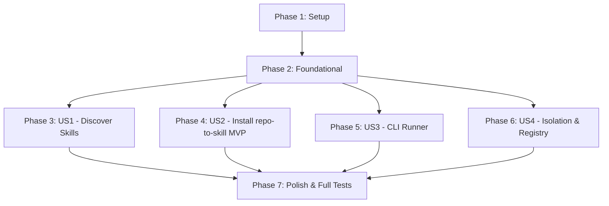

# Tasks: Custom Agent Skills Management (`buddhi skills`)

**Branch**: `001-custom-agent-skills-management` | **Date**: 2026-09-06 | **Spec**: [spec.md](file:///c:/DevDojo/Buddhi/buddhi-cli/.buddhi/specs/001-custom-agent-skills-management/spec.md) | **Plan**: [plan.md](file:///c:/DevDojo/Buddhi/buddhi-cli/.buddhi/specs/001-custom-agent-skills-management/plan.md)

---

## Phase 1: Setup (Shared Infrastructure)

**Purpose**: Initialize directory structure and package roots for custom skills.

- [x] T001 Create `src/buddhi/skills/` and `src/buddhi/templates/custom_skills/repo_to_skill/` directories
- [x] T002 [P] Initialize `__init__.py` in `src/buddhi/skills/` and `src/buddhi/templates/custom_skills/`

---

## Phase 2: Foundational (Blocking Prerequisites)

**Purpose**: Core registry, installer engine, and CLI command routing that MUST be in place before any individual user story can function.

- [x] T003 Implement `SkillRegistryEntry` dataclass and registry catalog in `src/buddhi/skills/registry.py`
- [x] T004 Implement selective template sync and conflict guard logic in `src/buddhi/skills/installer.py`
- [x] T005 [P] Create `skills_app` command structure in `src/buddhi/commands/skills.py` and register it in `src/buddhi/cli.py`

**Checkpoint**: Foundation ready — custom skill discovery and installation plumbing can now be implemented.

---

## Phase 3: User Story 1 - Discover Available Custom Skills (Priority: P1)

**Goal**: Running `buddhi skills` with no flags renders a formatted Rich table listing all available custom skills, their descriptions, and their respective CLI flags.

**Independent Test**: Execute `buddhi skills` without arguments; verify it outputs a Rich table displaying `--repo-to-skill` with description and exits with status 0.

### Tests for User Story 1
- [x] T006 [P] [US1] Write CLI tests for default `buddhi skills` listing in `tests/test_cli_skills.py`

### Implementation for User Story 1
- [x] T007 [US1] Implement Rich table listing logic in `src/buddhi/commands/skills.py`
- [x] T008 [US1] Verify listing tests pass via `uv run pytest tests/test_cli_skills.py -k test_skills_list`

**Checkpoint**: User Story 1 fully functional and testable independently.

---

## Phase 4: User Story 2 - Install `repo-to-skill` into Agent Harness (Priority: P1) 🎯 MVP

**Goal**: Running `buddhi skills --repo-to-skill` installs the Antigravity-optimized `repo-to-skill` skill into `<project_root>/.agents/skills/repo-to-skill/`.

**Independent Test**: In a test directory, run `buddhi skills --repo-to-skill`. Verify that `SKILL.md` (with valid Antigravity frontmatter) and references are created under `.agents/skills/repo-to-skill/`, and verify that `--force` allows overwriting while re-running without `--force` warns and skips.

### Template & Tests for User Story 2
- [x] T009 [P] [US2] Author Antigravity-optimized `SKILL.md` in `src/buddhi/templates/custom_skills/repo_to_skill/SKILL.md`
- [x] T010 [P] [US2] Bundle reference documents (`skill-format.md`, `eval-schemas.md`) in `src/buddhi/templates/custom_skills/repo_to_skill/references/`
- [x] T011 [P] [US2] Write unit tests for `--repo-to-skill`, skip-on-existing, `--force`, and `--path` in `tests/test_cli_skills.py`

### Implementation for User Story 2
- [x] T012 [US2] Wire `--repo-to-skill`, `--force`, and `--path` options in `src/buddhi/commands/skills.py`
- [x] T013 [US2] Verify skill installation and overwrite protection via `uv run pytest tests/test_cli_skills.py -k test_install`

**Checkpoint**: User Story 2 fully functional — MVP capability delivered.

---

## Phase 5: User Story 3 - Execute Skill Scripts via CLI Runner (Priority: P2)

**Goal**: Expose `buddhi skills run repo-to-skill <target> [--json]` and provide a pure Python cross-platform repository analyzer (`analyze_repo.py`) to eliminate bash dependencies on Windows.

**Independent Test**: Run `buddhi skills run repo-to-skill <local-or-remote-target> --json`; verify structured JSON output with project type, entry points, and dependencies.

### Implementation for User Story 3
- [x] T014 [P] [US3] Implement cross-platform repository analyzer in `src/buddhi/skills/repo_to_skill.py` and bundle as `src/buddhi/templates/custom_skills/repo_to_skill/scripts/analyze_repo.py`
- [x] T015 [P] [US3] Write tests for `buddhi skills run repo-to-skill` with local directories and `--json` flag in `tests/test_cli_skills.py`
- [x] T016 [US3] Wire `run` subcommand in `src/buddhi/commands/skills.py` to dispatch to registered skill runner
- [x] T017 [US3] Verify script execution via `uv run pytest tests/test_cli_skills.py -k test_runner`

**Checkpoint**: User Story 3 fully functional and testable across Windows, macOS, and Linux.

---

## Phase 6: User Story 4 - Extensible Registry & Template Isolation (Priority: P2)

**Goal**: Verify that selective custom skills remain completely isolated from `buddhi init` (not eagerly copied), and that the registry supports adding future skills easily.

**Independent Test**: Run `buddhi init` on a clean directory; verify that `.agents/skills/repo-to-skill/` is NOT created.

### Implementation for User Story 4
- [x] T018 [P] [US4] Write test in `tests/test_cli_skills.py` verifying that `buddhi init` does NOT copy `custom_skills` templates
- [x] T019 [US4] Add docstrings and extension guide in `src/buddhi/skills/registry.py` for adding future custom skills

**Checkpoint**: Architecture verified — isolation and extensibility guaranteed.

---

## Phase 7: Polish & Cross-Cutting Concerns

**Purpose**: Final verification, linting, and regression tests.

- [x] T020 [P] Review and refine CLI `--help` messages in `src/buddhi/commands/skills.py`
- [x] T021 Run entire test suite (`uv run pytest tests/`) to ensure 0 regressions

---

## Dependencies & Execution Order

- **Phase 1 & 2**: Block all user stories.
- **US1 & US2**: Deliver core MVP functionality.
- **US3 & US4**: Deliver advanced cross-platform execution and template isolation guarantees.
